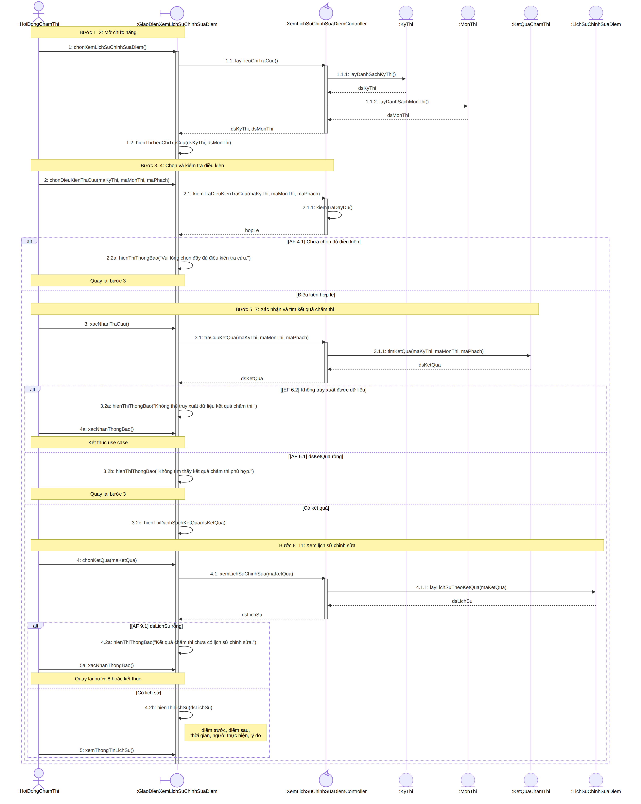
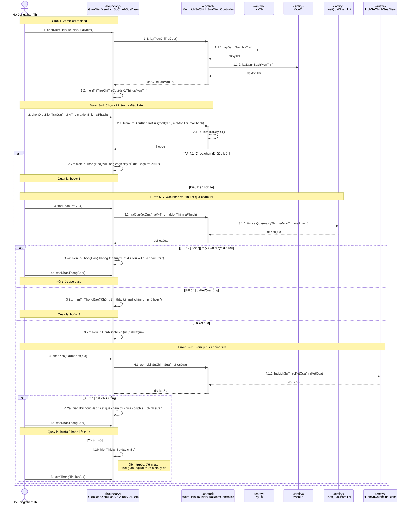

<<<<<<< HEAD
# UC12 – Xem lịch sử chỉnh sửa điểm (Sequence Diagram)

Sơ đồ tuần tự cho use case **Xem lịch sử chỉnh sửa điểm**, actor **Hội đồng chấm thi**, vẽ theo kiến trúc **BCE (Boundary – Control – Entity)**.

## Các đối tượng

| Loại | Tên |
|---|---|
| Actor | `HoiDongChamThi` |
| Boundary | `GiaoDienXemLichSuChinhSuaDiem` |
| Control | `XemLichSuChinhSuaDiemController` |
| Entity | `KyThi`, `MonThi`, `KetQuaChamThi`, `LichSuChinhSuaDiem` |

## Sơ đồ (ảnh)

## Sơ đồ (Mermaid – GitHub tự render)

## Quy ước đánh số message

- Message từ Actor: số nguyên `1, 2, 3…`
- Message được gọi lồng bên trong: thêm cấp `1.1`, `1.1.1`…
- Các nhánh loại trừ nhau trong `alt`: cùng số, thêm hậu tố `a, b, c` (ví dụ `3.2a`, `3.2b`, `3.2c`)
- Return message (nét đứt) không đánh số
- Guard của fragment ghi theo luồng trong đặc tả: `AF` = Alternative Flow, `EF` = Exception Flow

## Ánh xạ luồng đặc tả → fragment

| Luồng | Fragment |
|---|---|
| AF 4.1 – Chưa chọn đủ điều kiện | `alt` → thông báo, quay lại bước 3 |
| EF 6.2 – Không truy xuất được dữ liệu | `alt` → thông báo, kết thúc use case |
| AF 6.1 – Không tìm thấy kết quả | `alt` → thông báo, quay lại bước 3 |
| AF 9.1 – Chưa có lịch sử chỉnh sửa | `alt` → thông báo, quay lại bước 8 hoặc kết thúc |

## Các file

| File | Mô tả |
|---|---|
| `UC12_Sequence_XemLichSuChinhSuaDiem.png` | Ảnh sơ đồ |
| `UC12_XemLichSuChinhSuaDiem.puml` | Mã PlantUML (dán vào plantuml.com / VS Code) |
| `UC12_XemLichSuChinhSuaDiem.mmd` | Mã Mermaid gốc (có icon boundary/control/entity) |
=======
# -sequence-diagram
>>>>>>> 267cfefeb8888c1613390ecb60c3f5946c3d362d
